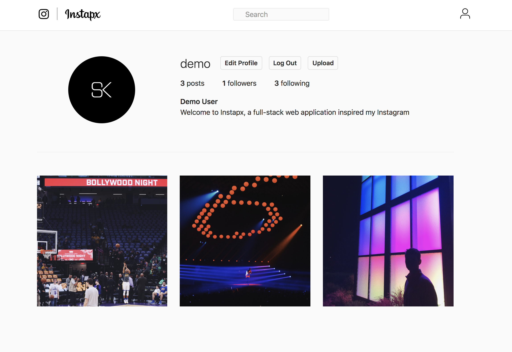
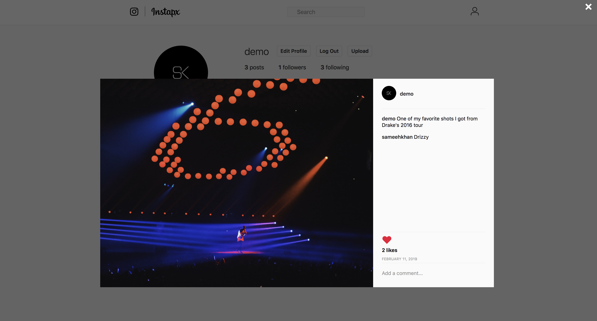
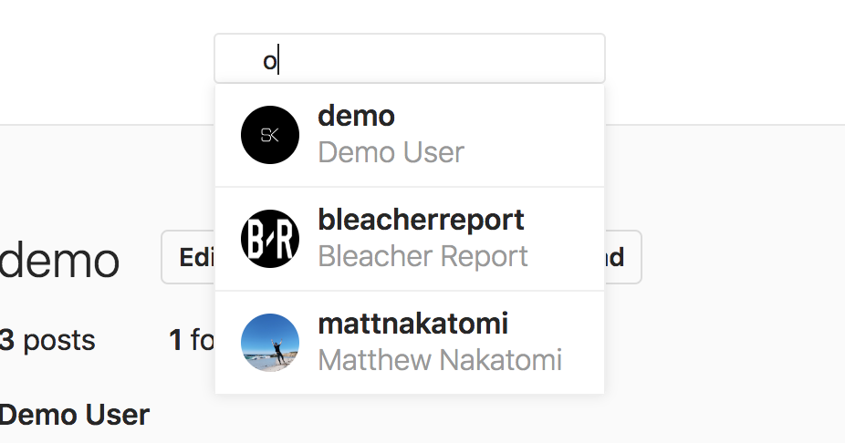

# Table of Contents
- [Background and Overview](#background-and-overview)
  - [Demo](#demo)
- [Technologies](#technologies)
- [Site](#site)
  - [Splash Page](#splash-page)
  - [Posts](#posts)
  - [Info](#info)
- [Feature Highlights](#feature-highlights)
  - [Video Search](#video-search)
  - [Info and Dropdown Effects](#video-info-dropdown-and-effects)

## Background and Overview

Instagram is a clone of the social media site, Instagram. On this site, users are able to create new accounts and login and view and post pictures.

Features cloned from Instagram include:
* User authentication
* Feed
* Profile
* Post Modals
* Likes
* Comments
* User Search
* Follows


### Demo
[Live Link](https://instapx.herokuapp.com/#/)

## Technologies

Instapx was built on a `Ruby on Rails` backend with a `React/Redux` front end. User data such as login and list information was stored in a `PostgreSQL` database. Images are stored and accessed through `AWS S3`. 

## Site

### Splash Page

The Instapx splash page/user authentication is an exact clone of Instagram, without facebook links. It features the same background, fonts, and iPhone template as of January 2019.


### Posts

Instapx posts can be accessed through three means. Posts from users you follow are available upon login, on the feed page. A user's own posts can be viewed on their own profile, and on their feed. Any user's profile features all of their posts as well as a pop up modal on click for any post.







### Info


## Feature Highlights

### Search

Incorporating the search functionality was at first at first challenging. My approach from a high-level perspective was to fetch all the users within the search container so that I have access to them while searching, and against refreshes, however it proved difficult to include it all within the nav bar, so it was split into its own component. 

* Search functionality was spread over two components
* Once the user begins typing, the search bar has a drop down showing all results that match the query string
* As with Instagram, the results are capped at a certain amount, and overflow is then scrollable. 
* An issue I ran into originally, was that the query string as well as the results would be present even after clicking a link to a user's page, to rectify this I utilized the ComponentWillUpdate() React lifecycle method. 




```
// search.jsx

componentDidMount() {
        this.props.fetchUsers();
    }

    componentDidUpdate(prevProps){
        if(prevProps.location.pathname != this.props.location.pathname){
            this.setState({
                search: '',
                users: []
            });
        }
    }


    update(field) {
        return e => { 
            let filtered = this.props.users.filter(user => user.username.includes(e.target.value));
            if(e.target.value === ''){
                filtered = [];
            }
            this.setState({

            [field]: e.target.value,
            users: filtered
        });
        };
    }
```


[Back to Top](#)